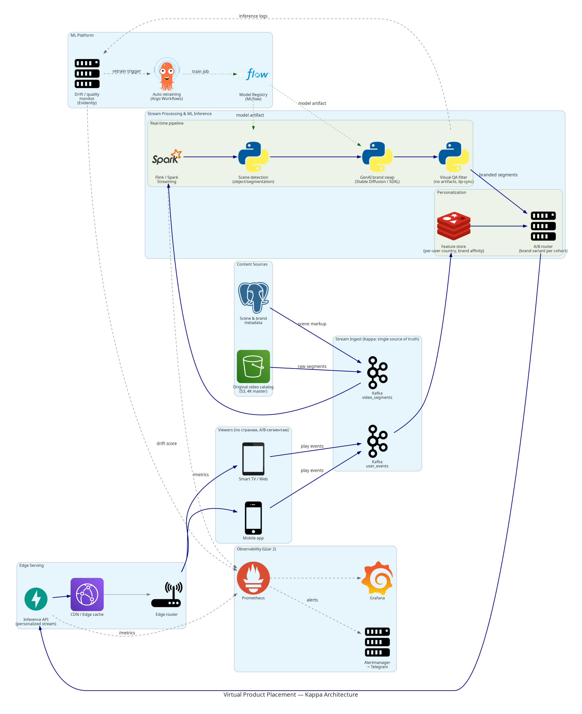

# Шаг 5. Архитектура ML-системы для Virtual Product Placement

## Контекст задачи

Netflix (с 2023 г.) заменяет бренды в уже снятых сценах в реальном времени, в зависимости от страны и сегмента зрителя — например, бутылка Pepsi в фильме превращается в Coca-Cola для зрителей из США. Это нужно реализовать как ML-систему.

## Какие вопросы задаём перед выбором архитектуры

| Вопрос | Ответ |
|--------|-------|
| Природа и объём данных? | Неструктурированный видеопоток, миллионы сегментов в сутки. Хорошо распараллеливается. |
| Скорость обработки? | Near-real-time (доставка переписанного видео идёт в момент просмотра). Допустим микробатчинг по 1–2 сек кадров. |
| Допустимая задержка? | Жёсткий бюджет: < ~200 ms сверх обычного TTFB CDN — иначе зритель увидит «затык» в воспроизведении. |
| Отказоустойчивость? | Высокая: при сбое — fallback на оригинальный (не модифицированный) сегмент, ни одного дропа. |
| Масштабируемость? | Растёт вместе с каталогом + аудиторией → нужна горизонтальная шардируемая обработка. |

## Lambda vs Kappa — почему Kappa

| Критерий | Lambda | Kappa |
|----------|--------|-------|
| Слои | 2 (batch + speed), результаты сливаются | 1 поток |
| Сложность кода | x2 (две реализации одной логики) | x1 |
| Источник истины | расщеплённый: batch и speed расходятся | единый: лог-стрим (Kafka) |
| Подходит, если… | нужен дорогой долгий пересчёт по историческим данным | данные изначально потоковые, пересчёт = replay лога |

В нашей задаче:
- данные **уже** потоковые (видео-сегменты приходят чанками во время воспроизведения),
- пересчёт «как было бы, если бы модель была обновлённая» = replay тех же сегментов через тот же стрим-пайплайн с новой версией модели,
- никакой ценности от отдельного batch-слоя нет — он бы только дублировал логику замены брендов.

**Выбор: Kappa.** Один pipeline, один источник истины (Kafka `video_segments`), обновление модели — это просто реплей последних N часов потока с новой версией.

## Архитектура (диаграмма)



Слои на схеме:

1. **Viewers** — мобильные/TV-клиенты, эмитят `play_events` (страна, segment_id, сегмент A/B).
2. **Content Sources** — мастер-видео в S3 + Postgres с разметкой сцен и брендов.
3. **Stream Ingest** — два Kafka-топика: `video_segments` (видео) и `user_events` (контекст пользователя).
4. **Stream Processing & ML** (главный pipeline Kappa):
   - Flink/Spark Streaming раскидывает работу на воркеры;
   - детектор сцен находит места для вставки;
   - GenAI-модель (Stable Diffusion / SDXL) генерирует замену бренда;
   - QA-фильтр отбрасывает кадры с артефактами и lip-sync проблемами.
5. **Personalization** — Redis feature store с per-user атрибутами + A/B-router выбирает вариант бренда для конкретного зрителя.
6. **ML Platform** — MLflow (registry), Argo Workflows (переобучение), Evidently (drift/quality monitor). Это «sidecar» к основному потоку, не блокирующая часть.
7. **Observability** — это ровно тот стек, что мы подняли в [Шаге 2](../README.md): Prometheus + Grafana + Alertmanager → Telegram. Сюда приходят и метрики приложения, и `drift_score` из Evidently.
8. **Edge Serving** — Inference API, CDN (CloudFront), edge-router, доставляющий персонализированный сегмент в правильный плеер.

### Цветовая легенда

- **Синие сплошные стрелки** — основной потоковый поток данных (видео и события).
- **Зелёные пунктирные** — control-plane (артефакты моделей, train jobs).
- **Серые пунктирные** — телеметрия и фидбек-петля от monitor'а к retrain.

## Что обеспечивают компоненты

| Требование задачи | Как реализовано |
|-------------------|-----------------|
| Реальное время | Flink stream processing + Redis для быстрых лукапов фич |
| Замена по странам / A/B | A/B router, который читает фичи зрителя из Redis перед выбором варианта |
| HA / отказоустойчивость | Kafka replay при сбое воркера; fallback в CDN на исходный сегмент |
| Масштабируемость | Шардирование Kafka-партиций, параллельные воркеры Flink, GPU-пул для SDXL |
| Мониторинг и алерты | Шаг 2: Prometheus + Grafana + Alertmanager → Telegram |
| Data/Model drift | Шаг 3: Evidently → метрика `drift_score` → Prometheus → Alertmanager |

## Как сгенерировать PNG

```bash
cd hw8/diagrams

# 1. Системно нужен бинарь graphviz (даёт команду `dot`):
sudo apt install graphviz                          # Ubuntu/Debian
# или без sudo:
conda install -c conda-forge graphviz             # вариант через conda

# 2. Python-пакет diagrams
python -m venv .venv
.venv/bin/pip install -r requirements.txt

# 3. Сгенерировать схему
.venv/bin/python vpp_architecture.py
ls -la vpp_architecture.png
```

В результате рядом со скриптом появится `vpp_architecture.png` — этот файл попадает в репозиторий и в `screenshots/`.
